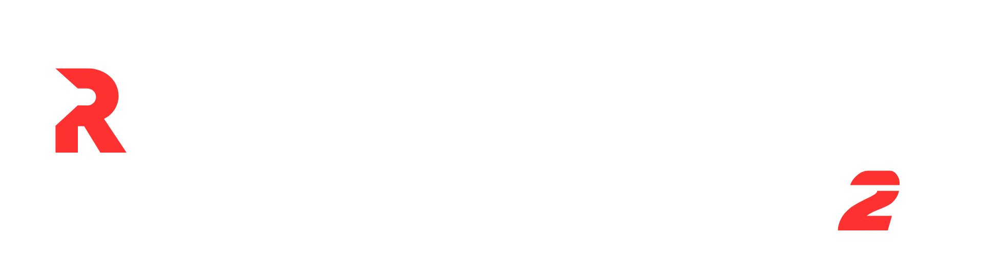

# 💠 Rock Cloner V2 – Discord Server Cloner (Windows EXE)

A standalone Windows application that allows you to **clone an entire Discord server’s structure** from one server to another — no Python setup required.  

Built with **PyQt6** for a modern UI experience.

---

## ⚙️ Features

✅ Clone everything from one Discord server to another:
- Roles (with permissions)  
- Categories and channels (text + voice)  
- Emojis *(optional)*  
- Server name and icon  
- Auto-clean destination server before cloning  

💻 Additional Features:
- Interactive, modern GUI  
- Settings tab for configuration  
- Optional emoji and icon copying  
- Built-in documentation and credits section  

---

## 🚀 How to Use

1. **Download the latest Rock Cloner V2 ZIP** from the [Releases](../../releases/tag/v2.0) section.  
2. Extract the folder anywhere on your PC.  
3. Run `main.exe`.  
4. Enter your **Discord bot token** and **source/destination server IDs**.  
5. Click **Start Clone** — the tool will do the rest!  

---

## 🪄 Notes

- Requires a **bot token** with `Manage Server`, `Manage Channels`, `Manage Roles`, and `Read Messages` permissions.  
- The bot must be in **both servers** (source & destination).  
- Built for **Windows 10/11** (64-bit).  
- All files are self-contained — no installation or setup required.  

---

## 🧩 Credits

- UI/UX: **Devrock**  
- Framework: **PyQt6 + Nuitka**  
- Author: [Dev Bhakat](https://github.com/devrock07)  

---

## 🐛 Troubleshooting

If the EXE doesn’t open:
- Right-click → *Run as Administrator*  
- Disable antivirus temporarily (some AVs flag PyInstaller/Nuitka builds)  
- Check if `config.json` exists inside `/data`  

If issues persist, create a [GitHub Issue](../../issues) with your error screenshot.

---

⭐ **Star the repo if you like it!**

